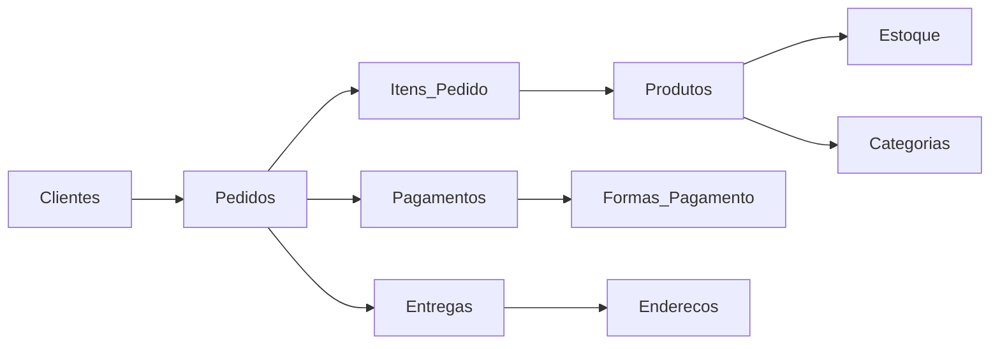

# Sistema E-commerce - Modelagem de Banco de Dados

[](https://choosealicense.com/licenses/mit/)
[](https://postgresql.org/)
[](https://www.sql.org/)

## 📋 Sobre o Projeto

Este projeto apresenta uma **modelagem completa de banco de dados** para um sistema de e-commerce, desenvolvida em PostgreSQL. O sistema foi projetado para suportar operações comerciais complexas, incluindo gestão de clientes (PF/PJ), produtos, pedidos, pagamentos, estoque e entregas.

### ✨ Características Principais

- 🏢 **Clientes diversificados**: Suporte completo para Pessoa Física (PF) e Pessoa Jurídica (PJ)
- 📦 **Gestão de produtos**: Categorização hierárquica e controle de estoque
- 🛒 **Pedidos complexos**: Múltiplos itens, descontos e formas de pagamento
- 🚚 **Logística avançada**: Rastreamento de entregas e múltiplas transportadoras
- 👥 **Vendedores terceiros**: Sistema de comissões e gestão de vendedores
- 📊 **Análises integradas**: Views e consultas para relatórios gerenciais

## 🗄️ Estrutura do Banco de Dados

### Principais Entidades

| Tabela | Descrição | Registros |
|--------|-----------|-----------|
| **Clientes** | Cadastro de clientes PF/PJ com validações específicas | 5 |
| **Produtos** | Catálogo de produtos com categorização | 5 |
| **Pedidos** | Transações de venda com status e valores | 5 |
| **Estoque** | Controle de quantidade por produto/vendedor | 5 |
| **Entregas** | Rastreamento e status de envios | 4 |
| **Pagamentos** | Múltiplas formas de pagamento por pedido | 5 |

### Relacionamentos Principais



## 🚀 Como Usar

### Pré-requisitos

- PostgreSQL 12+ instalado
- Cliente SQL (pgAdmin, DBeaver, etc.)
- Permissões para criar banco de dados

### Instalação

1. **Clone o repositório**
```bash
git clone https://github.com/seu-usuario/ecommerce-database.git
cd ecommerce-database
```

2. **Crie o banco de dados**
```sql
CREATE DATABASE ecommerce;
\c ecommerce;
```

3. **Execute o script completo**
```bash
psql -U seu_usuario -d ecommerce -f datebase/fullscript.sql
```

Ou execute os scripts separadamente:

```bash
# Criar estrutura
psql -U seu_usuario -d ecommerce -f datebase/schema/*.sql

# Inserir dados
psql -U seu_usuario -d ecommerce -f datebase/data/*.sql
```

## 📊 Consultas e Análises

O projeto inclui **12 consultas complexas** que demonstram:

### 1. Análises de Produtos
```sql
-- Produtos mais caros do catálogo
SELECT nome, preco, id_categoria
FROM Produtos 
WHERE status_produto = 'Ativo'
ORDER BY preco DESC, nome ASC;
```

### 2. Análises de Clientes
```sql
-- Clientes com maior volume de compras
SELECT c.nome, c.tipo_cliente, 
       COUNT(p.id_pedido) as total_pedidos,
       SUM(p.valor_total) as valor_total_compras
FROM Clientes c
JOIN Pedidos p ON c.id_cliente = p.id_cliente
GROUP BY c.id_cliente, c.nome, c.tipo_cliente
HAVING SUM(p.valor_total) > 1000
ORDER BY valor_total_compras DESC;
```

### 3. Performance de Entregas
```sql
-- Taxa de sucesso por transportadora
SELECT transportadora,
       COUNT(*) as total_entregas,
       COUNT(CASE WHEN status_entrega = 'Entregue' THEN 1 END) as entregas_concluidas,
       ROUND((COUNT(CASE WHEN status_entrega = 'Entregue' THEN 1 END)::DECIMAL / COUNT(*)) * 100, 2) as taxa_sucesso
FROM Entregas
GROUP BY transportadora
ORDER BY taxa_sucesso DESC;
```

## 🔍 Views Disponíveis

### Resumo de Clientes
```sql
SELECT * FROM vw_resumo_clientes;
```
- Total de pedidos por cliente
- Valor total de compras
- Ticket médio

### Controle de Estoque
```sql
SELECT * FROM vw_controle_estoque;
```
- Níveis de estoque (CRÍTICO, BAIXO, MÉDIO, ALTO)
- Localização dos produtos
- Responsável pelo estoque

## 📁 Estrutura do Projeto

```
datebase/
├── schema/                 # Estrutura das tabelas
│   ├── tabelaCliente.sql
│   ├── tabelaProdutos.sql
│   ├── tabelaPedidos.sql
│   └── ...
├── data/                   # Dados de exemplo
│   ├── insertClientes*.sql
│   ├── insertProdutos.sql
│   └── ...
├── queries/                # Consultas de análise
│   ├── analysis-1.sql
│   ├── analysis-2.sql
│   └── ...
├── views/                  # Views para relatórios
│   ├── viewClientes.sql
│   └── viewControleEstoque.sql
└── fullscript.sql         # Script completo
```

## 🎯 Funcionalidades Implementadas

### ✅ Gestão de Clientes
- [x] Separação PF/PJ com campos específicos
- [x] Validações de CPF/CNPJ
- [x] Múltiplos endereços por cliente
- [x] Histórico de compras

### ✅ Catálogo de Produtos
- [x] Categorização hierárquica
- [x] Controle de status (Ativo/Inativo/Descontinuado)
- [x] Dimensões e peso
- [x] Relacionamento com fornecedores

### ✅ Processamento de Pedidos
- [x] Múltiplos itens por pedido
- [x] Sistema de descontos
- [x] Controle de status
- [x] Múltiplas formas de pagamento

### ✅ Logística
- [x] Códigos de rastreamento
- [x] Múltiplas transportadoras
- [x] Previsão e data real de entrega
- [x] Cálculo de frete

### ✅ Análises e Relatórios
- [x] Performance de vendas
- [x] Análise de estoque
- [x] Comportamento de clientes
- [x] Eficiência de entregas

## 🔧 Recursos Técnicos

### Constraints e Validações
- ✅ Verificação de tipos de cliente (PF/PJ)
- ✅ Validação de valores positivos
- ✅ Integridade referencial completa
- ✅ Campos obrigatórios por contexto

### Índices de Performance
```sql
CREATE INDEX idx_clientes_email ON Clientes(email);
CREATE INDEX idx_pedidos_data ON Pedidos(data_pedido);
CREATE INDEX idx_produtos_categoria ON Produtos(id_categoria);
-- ... outros índices otimizados
```

### Triggers Automáticos
- 🔄 Atualização automática de timestamps
- 📊 Auditoria de alterações no estoque

## 📈 Casos de Uso

Este sistema suporta cenários reais como:

1. **E-commerce B2C/B2B**: Vendas para pessoas físicas e jurídicas
2. **Marketplace**: Vendedores terceiros com comissões
3. **Gestão de estoque**: Controle distribuído por localização
4. **Logística complexa**: Múltiplas transportadoras e rastreamento
5. **Análise de negócios**: Relatórios gerenciais completos

## 🤝 Como Contribuir

1. Faça um fork do projeto
2. Crie uma branch para sua feature (`git checkout -b feature/AmazingFeature`)
3. Commit suas mudanças (`git commit -m 'Add some AmazingFeature'`)
4. Push para a branch (`git push origin feature/AmazingFeature`)
5. Abra um Pull Request

## 📄 Licença

Este projeto está sob a licença MIT. Veja o arquivo [LICENSE](LICENSE) para mais detalhes.

## 👨‍💻 Autor

**Otavio2007**

- GitHub: [@Otavio2007](https://github.com/Otavio2007)

---

⭐ Se este projeto te ajudou, considere dar uma estrela!

## 📞 Suporte

Se você encontrar algum problema ou tiver sugestões, por favor abra uma [issue](https://github.com/Otavio2007/ecommerce-database/issues).
